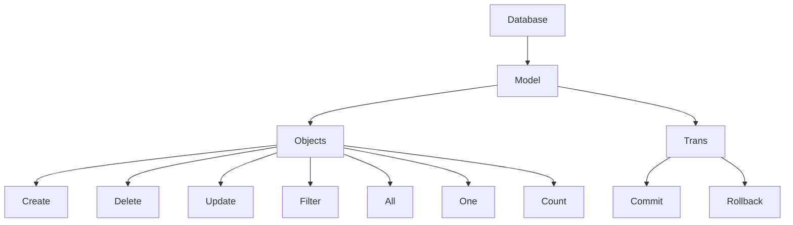

# Simple ORM in Go

> 概念与方法, 灵感来自`django`。

```mermaid
graph TD;
    Database-->Model;
    Model-->Objects;
    Objects-->Create;
    Objects-->Delete;
    Objects-->Update;
    Objects-->Filter;
    Objects-->All;
    Objects-->One;
    Objects-->Count;
    Model-->Trans;
    Trans-->Commit;
    Trans-->Rollback;
```
